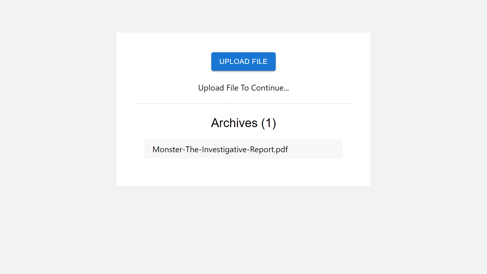

### SpeedRead: Revolutionizing Book Consumption

> [!WARNING]
> Project Under development and undocumented

Welcome to SpeedRead, the cutting-edge platform that empowers you to conquer books at an unprecedented pace, without sacrificing comprehension or enjoyment. Prepare to embark on a literary odyssey like no other!

The Art of Distillation
At the heart of SpeedRead lies a ingenious algorithm that seamlessly condenses the essence of every page into concise, insightful summaries. With each turn of the page, our sophisticated system analyzes the content, extracting the most vital information while preserving the narrative's coherence and flow.

Adaptive Intelligence
But that's not all! SpeedRead's true brilliance lies in its adaptive intelligence. As you progress through the book, our system continuously updates the general summary, ensuring that the most recent details are weighted more heavily, while still retaining the overarching plot and context. It's like having a personal literary companion, guiding you through the twists and turns of the story, always keeping you informed and engaged.

Experience Literature, Redefined
With SpeedRead, you'll never miss a beat. Whether you're a voracious reader, a busy professional, or a student juggling multiple texts, our platform empowers you to consume literature at your own pace, without sacrificing depth or enjoyment.

Prepare to be captivated, challenged, and ultimately, transformed. Welcome to the future of reading – welcome to SpeedRead.

